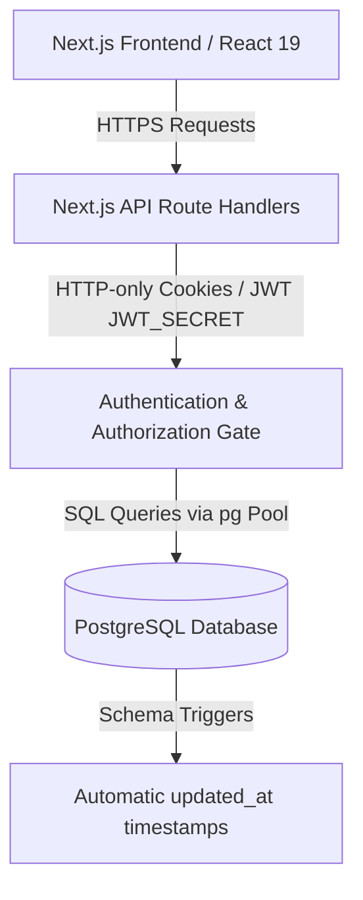

# 🏫 School & Coaching Management System (FIT Portal)

A comprehensive, enterprise-grade institutional management system for **Fontana Institute of Technology (FIT)**. Built on **Next.js (App Router)**, **React 19**, **Tailwind CSS**, and **PostgreSQL**, this platform integrates all aspects of a modern educational institute—from academics, LMS, and biometric/RFID attendance to grading transcripts, multi-role financial ledgers, and inventory management.

---

## 🏗️ Architecture & Technology Stack



### Core Technologies:
- **Frontend Framework**: **Next.js 15 (App Router)** using client-side React 19 paradigms.
- **Styling Engine**: **Tailwind CSS v4** for clean UI design, utilizing CSS variables.
- **Database Backend**: **PostgreSQL** with raw SQL query pipelines via the node-postgres (`pg`) client connection pool.
- **Security & Session Auth**: Password hashing via `bcryptjs` and session authorization utilizing JSON Web Tokens (JWT) stored in secure HTTP-only cookies.
- **Micro-interactions**: `react-hot-toast` for real-time validation and actions feedback, and `react-icons` (Feather/Io5/Fa/Md packs) for standard menu triggers.

---

## 📁 Repository Structure

```
├── public/                 # Static asset resources (Logos, Icons)
├── schema.psql             # Primary PostgreSQL schema definition (tables, indexes, triggers)
├── scripts/                # Database seed and table setup scripts
│   ├── setup-db-tables.js  # Main academic tables (classes, students, attendance, fees)
│   ├── setup-clubs.js      # Co-curricular club mappings and tables
│   └── setup-results.js    # Exam routines, marking, and GPA grades
└── src/
    ├── app/                # Page Views & API Handler Directories
    │   ├── (admin)/        # Admin dashboard pages
    │   ├── (auth)/         # Auth gateways (Student, Teacher, Staff, Admin)
    │   ├── (staff)/        # Cashier and Registrar portal directories
    │   ├── (student)/      # Student dashboard, routine, and club portals
    │   ├── (teacher)/      # Teacher roster, grades, routines, and leaves
    │   ├── (home)/         # Public landing pages (/about, /events, /notices)
    │   └── api/            # API Route Handlers (REST controllers)
    ├── component/          # Shared components
    │   ├── bars/           # Responsive Navbar & Sidebar layouts
    │   └── helper/         # Context providers (Auth, Sidebar triggers)
    └── lib/                # Shared utility modules
        ├── auth.js         # JWT signing/verification & hashing helpers
        ├── db.js           # PostgreSQL client pool instance
        └── secret.js       # Loaded environment parameters
```

---

## 🗄️ Database Schema Specification (`schema.psql`)

The database consists of **50+ relational tables** designed to support normalized data operations, strict constraint checks, cascading deletes, and automated audit triggers.

### 1. Academic & Organization Setup
- `classes`: Standard academic classes (e.g. Class 9, Class 10). Contains `code`, `numeric_name`, and `max_seats` capacity rules.
- `sections`: Sub-units of classes containing section names, room numbers, and capacity limits. Unique mapping for `(class_id, name)`.
- `subjects`: List of institutional courses (e.g. Physics, Calculus, Literature) containing codes and names.
- `class_subjects`: Many-to-many bridge table mapping which subjects are taught in which classes.
- `days` & `periods`: Configuration tables for scheduling timetables and periods (e.g. Period 1: 9:00 AM - 9:45 AM).
- `class_routines`: Academic schedule grid linking days, periods, subjects, classes, sections, and teaching staff.

### 2. Human Resources & Roles
- `admins`: Credentials, recovery tokens, and activity status of system administrators.
- `teachers`: Official profile, designation, pay-scale tier, profile images, and verification tokens for educators.
- `teacher_qualifications`: List of academic degrees, universities, and gradings for teaching staff.
- `staffs`: Detailed profiles of administrative support employees. Restricted by database CHECK constraint to cashier, registrar, or general staff roles.
- `staff_applications`: Administrative requests or grievances submitted by staff to the administrative board.

### 3. Student Lifecycle Management
- `students`: Central student registry containing standard demographics, admissions status, enrollment date, and verification tokens.
- `student_enrollments`: Tracks academic history across session years, linking students, classes, and sections with rolling roll numbers.
- `student_guardians`: Contact details, relationship definitions, and security credentials of guardians.
- `student_documents`: File URLs and IDs (e.g. National IDs, previous transcripts) uploaded for verification.
- `student_transfers`: Student transfer system (TC) containing reasons, target schools, unique TC numbers, and approval status.
- `student_leaves`: Casual/Medical leave requests submitted by students or guardians with tracking statuses.

### 4. Biometrics, Attendance & Reporting
- `student_attendance_logs`: Raw scan logs capture RFID card entries and exit directions (`IN` / `OUT`) at biometric gates.
- `student_attendances`: Aggregated daily attendance logs (Present, Absent, Late, Half Day) with remarks.
- `teacher_attendances`: Workday attendance logs checked by administrators or self-logged check-ins.
- `staff_attendance`: Daily check-in/check-out logs for non-teaching personnel.
- `attendance_reports`: Monthly background summaries calculating total working days, present/absent counts, and net attendance percentages.

### 5. Learning Management System (LMS)
- `lesson_plans`: Teacher-created curriculum structures mapping out chapter targets, reference files, and weeks.
- `study_materials`: Digital lecture notes, reference PDFs, and slides uploaded for student download.
- `assignments`: Formal coursework containing deadlines, description briefs, and maximum score ranges.
- `assignment_submissions`: Student homework submissions. Constrains files, submission texts, grades, and status fields (Pending, Graded, Late).

### 6. Examination & Grading Ledger
- `exams`: Configuration of school terms (e.g. Midterm 2026, Annual Exam).
- `exam_subjects`: Defines passing thresholds, full marks, and pass marks for subjects within an exam context.
- `exam_schedules`: Room seating locations, exam dates, and start/finish timings.
- `marks`: Student scores registered by teachers for assignments, class tests, or term exams.
- `results`: GPA logs, letter grades, and total accumulated marks per term.
- `result_publish`: Status gates indicating if term results are released for public viewing.
- `transcripts`: Generated academic transcripts available for download.
- `mark_grades`: Grading scales (e.g. A+ for 80-100%, F for 0-32%).

### 7. Unified Financial Registry & Ledger
- `payment_transactions`: The unified institutional ledger. Every transaction logs a unique transaction number, payment method (Cash, Card, Bank), transaction type (`Credit` / `Debit`), categories, and status tracking (Success, Failed).
- `income_categories` & `incomes`: Tracks general incoming receipts (donations, facility hires, events).
- `expense_categories` & `expenses`: Tracks institutional spends (operational costs, utilities, lab equipment).
- `student_fees`: Billing schedules for student tuition, exam fees, or sports fees.
- `student_fines`: Late penalties or library fines logged against students.
- `student_fee_payments`: Linked ledger recording exact payments against student fee invoices.
- `admission_fees` & `admission_fee_payments`: Application billing logs and transactions for applicants.
- `teacher_pay_scale` & `staff_pay_scale`: Defines basic wages and allowances for HR tiers.
- `salaries` & `staff_salaries`: Monthly payroll slips generated for teachers and staff.
- `teacher_salary_payments` & `staff_salary_payments`: Records banking transactions for monthly salary payments.

### 8. Institutional Housing (Hostels)
- `hostels`: List of housing blocks (e.g. North Wing, Girls Hostel) and addresses.
- `hostel_rooms`: Setup of rooms within hostel blocks, containing bed capacities and numbers.
- `hostel_provost`: Designated faculty coordinators managing hostel blocks.
- `hostel_allocations`: Links active students to specific hostel rooms with check-in/out dates.
- `hostel_fees`: Specific lodging billing invoices generated monthly.

### 9. Public, Portals & Co-curricular
- `clubs`: Co-curricular school clubs (e.g. Robotics, Debating society).
- `clubs_admins`: Links teachers to specific clubs as coordinators.
- `club_members`: Student club rosters.
- `club_news`: Notices and newsletters published by clubs.
- `news` & `events`: Institutional bulletins and events calendars.
- `event_participants`: Links students or teachers to registered events.
- `notices`: Main administrative bulletin board.
- `collaborations`: Details of international academic partners.
- `achievements` & `recognitions`: Honors and awards won by the school or students.
- `announcements`: Push notifications shown across user dashboards.
- `website_settings`: Central configuration (titles, logos, contact phones, social links).
- `testimonials`: Graduate student feedback quotes.
- `login_logs`: Security trail tracking IP address, browser agents, and status of logins across all roles.

---

## 🔌 API Endpoint Directory

All APIs return consistent JSON payloads (e.g. `{ success: true, payload: ... }` or `{ success: false, error: ... }`).

### 1. Authentication Pathways (`/api/...`)
- `/api/admin/login` | `/api/admin/logout` | `/api/admin/recovery` | `/api/admin/register`: Admin account handlers.
- `/api/teachers/login` | `/api/teachers/register` | `/api/teachers/verify`: Teacher verification and credentials checking.
- `/api/staff/login` | `/api/staff/register` | `/api/staff/verify`: System access endpoints for office staff.
- `/api/student/login` | `/api/student/registration` | `/api/student/recovery`: Student portal auth pathways.

### 2. Administrator Portals (`/api/admin/...`)
- `/api/admin/website-settings`: Read/write logo configurations, contact information, and titles.
- `/api/admin/admissions`: Approve/reject admission applications and manage admission fee states.
- `/api/admin/finance/transactions`: Unified ledger auditing (credit vs debit lists).
- `/api/admin/finance/expenses` | `/api/admin/finance/incomes`: Operations cost log audits.
- `/api/admin/inventory/items` | `/api/admin/inventory/movements`: Stock balance checks and suppliers purchasing trackers.
- `/api/admin/staff`: CRUD for creating, modifying, and disabling cashier or registrar accounts.

### 3. Educator APIs (`/api/teacher/...`)
- `/api/teacher/dashboard`: Statistics summarizing total hours taught, active courses, and upcoming schedules.
- `/api/teacher/schedule`: Fetch classes schedule by days.
- `/api/teacher/attendence`: Log and view daily section attendance records.
- `/api/teacher/leaves`: Log leave applications and track approval state history.
- `/api/teacher/subjects`: Fetch allocated courses database.
- `/api/teacher/students-list`: Roster of students allocated under the teacher's modules.

### 4. Learner APIs (`/api/student/...`)
- `/api/student/dashboard`: Quick cards for present rates, club memberships, and current classes.
- `/api/student/routine`: Timetable routines for the logged-in student.
- `/api/student/attendance`: Fetch logs containing IN/OUT scans and calendar flags.
- `/api/student/exams`: View schedules, schedules dates, and locations.
- `/api/student/results`: View term results, GPAs, and mark details.
- `/api/student/fees`: Direct view of bills, payments, and late charges.
- `/api/student/clubs`: Roster of school clubs, including active `join` / `leave` actions.

### 5. Office Staff APIs (`/api/staff/...`)
- `/api/staff/cashier/...`: Process tuition payments, verify admissions fees, and issue salary updates.
- `/api/staff/registrar/...`: Modify routine files, upload student profiles, publish notices, and handle leaves.

### 6. Public Services APIs (`/api/public/...`)
- `/api/public/admissions/status`: Search admission application status using application IDs or emails.
- `/api/public/stats`: Institutional counters showing total students, faculty, and collaborations.
- `/api/verify-student`: Simple parameter check indicating if a student code represents an active scholar.

---

## 💻 Frontend Portals & Pages

The application divides page structures logically inside Next.js Route Groups:

### 1. Public Domain Pages `src/app/(home)/`
- `/about`: Institutional overview dashboard detailing statistics, administrative leadership profiles, and quality charters.
- `/about/history`: Premium vertical timeline charting institutional expansion since 2015.
- `/about/vision`: Statements on institutional values, quality charters, and ethics.
- `/about/mission-vission`: Comprehensive breakdown of mission targets and specific target benchmarks for 2030.
- `/about/campus` & `/about/campus-details`: Technical facilities specs (library hours, development microcontrollers, diagnostic gear, and accommodation assets).
- `/missions`: Public mission statements and strategic objectives layout.
- `/events`: School events list.
- `/apply`: Public registration page for prospective students.
- `/admission-status`: Application tracker tool.

### 2. Security Portals `src/app/(auth)/`
- `/auth/student`: Registration and login views for students.
- `/auth/access`: Tabbed login form for administrators, teachers, and staff.

### 3. Student Dashboard `src/app/(student)/student/`
- `/student`: Main dashboard displaying class summaries and attendance ratings.
- `/student/routine`: Timetable schedules card deck.
- `/student/results`: Printable academic reports with letter grading indicators.
- `/student/fees`: Interactive table of tuition slips and payment history logs.
- `/student/clubs`: Search, join, or leave school clubs.

### 4. Teacher Dashboard `src/app/(teacher)/teacher/`
- `/teacher`: Home view displaying summary cards of active modules, schedules, and leaves.
- `/teacher/schedule`: Schedule grids filterable by weekday.
- `/teacher/attendance`: Daily attendance grids containing checkboxes for quick register logging.
- `/teacher/marks`: Batched exam grading ledger for inputting scores.
- `/teacher/leaves`: Form to apply for Casual or Medical leaves with status tracking.

### 5. Support Staff Dashboard `src/app/(staff)/staff/`
- `/staff/cashier`: Multi-tab payment processing terminal (admissions, tuition, salary disbursements).
- `/staff/registrar`: Administrative registrar toolbox (notice publisher, routine planner, student registry, check-in logs).

---

## 🚀 Setup & Execution

### 1. Configuration
Create a `.env` file in the root workspace directory:
```env
PG_USER=your_postgres_user
PG_PASSWORD=your_postgres_password
PG_HOST=localhost
PG_PORT=5432
PG_DATABASE=school_db
JWT_SECRET=your_jwt_secret_key
```

### 2. Dependencies
Install the node packages:
```bash
npm install
```

### 3. Database Initialization
Verify that PostgreSQL is running, then populate database tables and relations by executing the schema and seed scripts:
```bash
# Initialize schema tables, indexes and triggers
psql -U your_postgres_user -d school_db -f schema.psql

# Populate seed directories
node scripts/setup-db-tables.js
node scripts/setup-clubs.js
node scripts/setup-results.js
```

### 4. Run Server
Run the local dev server:
```bash
npm run dev
```
Open [http://localhost:3000](http://localhost:3000) to view the application.
